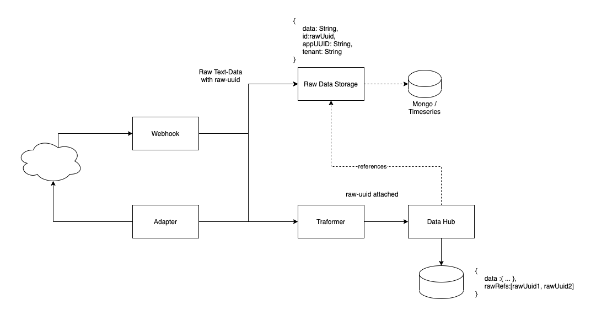

<!-- Description Guidelines

Please note:
Use the full links to reference other files or images! Relative links will not work under our theme settings settings.
-->

<!-- please choose the appropriate batch and delete/comment the others  -->

# **Raw Data Storage (RDS)** <!-- make sure spelling is consistent with other sources and within this document -->

## Introduction

<!-- 2 sentences: what does it do and how -->
As the name implies, whenever OIH receives data from external services, RDS stores this raw data in an interchangeable storage. Current reference implementation uses MongoDB, but any other storage (e.g. time series database) could also be implemented.

When raw data is received by an adapter, it is passed on to a transformer which transforms it into an OIH data model. The original raw data is hereby lost. This also means, that data not mapped by the transformation is also lost.

There are two main advantages having the original raw data:
* It can be used later by some connector
* Already transformed data in the Data Hub could be transformed again (replay) after modifying the underlying Master Data Model

[API Reference](https://rds.openintegrationhub.com/api-docs/){: .btn .fs-5 .mb-4 .mb-md-0 }
[Implementation](https://github.com/openintegrationhub/openintegrationhub/tree/master/services/rds){: .btn .fs-5 .mb-4 .mb-md-0 }

## Technologies used
<!-- please name and elaborate on other technologies or standards the service uses -->

Node.Js
MonogDB

## How it works
<!-- describe core functionalities and underlying concepts in more detail -->
The Ferryman library is used by all connectors. This library can have an optional flag set (`storeRawRecord`), which assigns a unique id (uuid) to any raw data object before it is sent to the RDS service via the queue. The RDS service stores this data with the given id reference. Additionally, the raw data reference (RFS) is passed on during flow execution until it is received by Data Hub. Data Hub stores both the transformed data, and the reference in its database.  

When the transformed data is deleted from Data Hub, all references are also deleted, if they aren't referenced by any other node in Data Hub. 

## Versioning and operation order

An entity or data could be modified multiple times (e.g. patching). Such updates can be partial updates containing only updated values. Thus, the transformed object in Data Hub is the entirety of all operations (at least known to the Data Hub). To have all raw data in the correct order, Data Hub stores all RFS references in an array of the target object (stack).

Limitations: MongoDB (reference implementation) documents have a max size. If the reference array were to grow to a considerable size, this limit might be reached. A possible solution would be, to have a capped array, but this may lead to lost data entries. 
